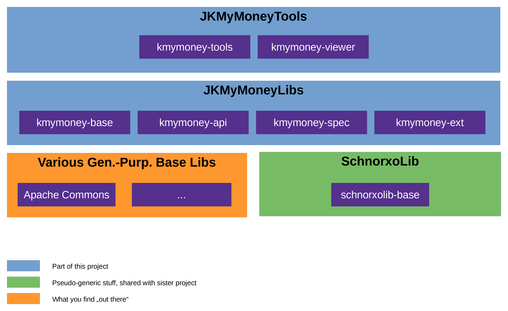

# Project "Java KMyMoney Lib 'n' Tools"

`JKMyMoneyLibNTools` 
is a free and open-source set of Java-libraries for reading and writing the XML file 
format of the 
KMyMoney open source personal finance software 
([kmymoney.org](https://kmymoney.org)).

This project is not affiliated with nor sponsored or coordinated by the developers of the 
KMyMoney 
project.

## Modules and Further Details

Here is a high-level overview:

List of modules and other relevant stuff:

* JKMyMoneyLibs (the API)

  The four following together form the API:

  * [Base (kmymoney-base)](https://github.com/jross765/kmymoney-base)

    Some basic data types and helper classes (project-specific).

  * [API (kmymoney-api)](https://github.com/jross765/kmymoney-api)

    The Core API (read/write) -- no bells, no whistles, yet still providing a certain level 
    of convenience as well as solid type safety and input-value checks.

    "Good and well-tested wrappers for the the JAXB-generated classes".

  * [API Specialized Entities (kmymoney-spec)](https://github.com/jross765/kmymoney-api-spec)

    Bells & whistles, part 1: Some specialized classes derived from the Core API.

  * [API Extensions (kmymoney-ext)](https://github.com/jross765/kmymoney-api-ext)

    Bells & whistles, part 2: Some specialized helper classes providing
    high-level functionalities based on low-level actions in of both the Core API
    and the Specialized Entities.

* JKMyMoneyTools:

  * [Tools (kmymoney-tools)](https://github.com/jross765/kmymoney-tools)

    CLI Tools (read/write).

  * [Viewer (kmymoney-viewer)](https://github.com/jross765/kmymoney-viewer)

    The (read-only) GUI.

  * [Example Programs (kmymoney-api-examples)](https://github.com/jross765/kmymoney-api-examples)

    Some examples on how to use the API (all levels).

    Actually not "officially" part of the 
    JKMyMoneyTools, 
    but we won't define a new category just for this one, and they are in the same ballpark...

* Project-specific basic stuff:

  There is one project-specific pseudo-base-lib containing some semi-generic
  stuff used by this project as well as by its sister:

  [SchnorxoLib](https://github.com/jross765/schnorxolib)

  It contains some basic data types and helper classes
  used by both projects.

* Miscellaneous:

  Of course, a couple of "real" libs are also used:

  * [Jakarta XML Binding (JAXB)](https://eclipse-ee4j.github.io/jaxb-ri/)

    Obviously...

  * [Apache Commons](https://commons.apache.org)

    Ye olde venerable collection of general-purpose Java libs.
    The following ones are used:

    * [CLI](https://commons.apache.org/proper/commons-cli/)
    * [Configuration](https://commons.apache.org/proper/commons-configuration/)
    * [IO](https://commons.apache.org/proper/commons-io/)
    * [Lang](https://commons.apache.org/proper/commons-lang/)
    * [Numbers](https://commons.apache.org/proper/commons-numbers/)
    * [Text](https://commons.apache.org/proper/commons-text/)

    Actually, the Configurtion lib is, at this stage, not really
    used yet. But it's ready to be and definitely will.

  * [Joda Money](https://www.joda.org/joda-money/)

    (Doesn't provide real added value in this project. We will therefore 
    probably get rid of that dependency in the next release).

  * [Progress Bar](https://github.com/ctongfei/progressbar/)

  * [JLine](https://jline.org/)

## Compatibility
Cf. document "[Compatibility](https://github.com/jross765/JKMyMoneyLibNTools/compatibility.md)".

## Major Changes
Cf. document "[Major Changes](https://github.com/jross765/JKMyMoneyLibNTools/major_changes.md)".

## Level of Maturity
This software is beta.

It is worth noting, though, that the author has been using both the published tools 
as well as some unpublished ones (the latter ones also based on 
`JKMyMoneyLibs`) 
on a nearly daily basis 
for two years now (july 2026)
to facilitate and part-automate his 
private finances' 
accounting. This proves that the software is well-tested and stable enough 
for a real-world setting (as opposed to theoretical test cases and arbitrary examples).

Therefore, the current maintainer now feels confident not just to use the software in 
his own particular productive environment, but also to encourage others to use it. 
However, he is experienced a developer enough to know that there are other production 
environments and other use cases out there, and that only by further usage and testing 
by at least a handful of other users in real-world scenarios for a year or so, the 
software can mature to finally attain genuine "production-ready" status.

In short: You are encouraged to use this software, but be advised to use it under the following principles:

*  Consider the API's read-branch and the read-only tools to be safe (i.e., they are not only *called* read-only, but they actually *are*).

* As for the write-branch, take the usual precautions: 

  * Do not just take the software and "wildly" change things in your valuable 
    KMyMoney 
    files that you may have been building for years or possibly even decades. 
    It still might contain some non-trivial bugs, and you should not assume that 
    it works correctly in all conceivable edge and corner cases.
  * If you write your own tools, be aware that the lib allows you to *change* the 
    KMyMoney 
    file loaded. You are, however, advised not to do so in the beta stage, but 
    rather to *generate a new one* instead (as done in the published tools) and 
    keep the old version for a while.
  * If you have to change your file, **make backups before you use this lib/these tools!** Take your time and check the generated/changed files thoroughly before moving on.
    The `diff` tool is your friend as well as the provided `Dump` tool!

## Compile and Install
Cf. document "[Compile and Install](https://github.com/jross765/JKMyMoneyLibNTools/compile_install.md)".

## Planned

### Overall
* Possibly contribute some more Java tools / wrapper scripts that already exist in separate repositories that currently are not published.

### Module-Specific
Cf. the according module's README file (links above).

## Sister Project
This project has a sister project: 
[`JGnuCashLibNTools`](https://github.com/jross765/JGnuCashLibNTools).

By now, both projects have roughly the same level of maturity. 
Obviously, the author strives to keep both projects symmetrical.

What does "symmetry" mean in this context? It means that 
this project 
has literally evolved from a source-code copy of
its sister, `JGnuCashLibNTools`.
Meanwhile, changes and adaptations are going in both directions.
Let's call this "coupled development". 
Given that KMyMoney and GnuCash are two finance applications with quite a few 
similarities (both in business logic and file format), this approach makes sense
and has been working well so far.

Of course, this is a "10.000-metre bird's-eye view". As always in life, things are a little more
complicated once you go into the details. Still, looking at the big picture and at least 
up to the current state of development, the author/maintainer has managed to keep both projects 
very similar on a source code level -- so much so that, throughout large parts of the code,
you can use `diff`. You will, however, also see some exceptions here and there where that 
"low-level-symmetry" is not maintainable.

## Acknowledgements

Special thanks to **Marcus Wolschon (Sofware-Design u. Beratung)**, **Deniss Larka** and **Roberto Bertolino** -- 
they don't/did not contribute directly to this project, but they did the pioneering and 
stewardship work of the sister project `JGnuCashLibNTools` (and its predecessor, resp.) for quite
a few years, long before the current author/maintainer got into it. This project heavily makes use of the 
approaches and techniques in said project.
