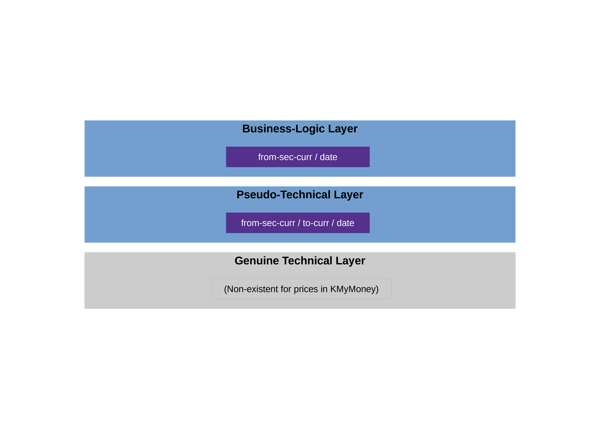

# Selecting Securities (Users)

Due to the specialness of prices, both on the technical level and 
on the business-logic level, there are several things you must understand/keep in mind 
before working with them.

In a nutshell, it boils down to the following:

* *Technical level*: Prices have no technical IDs in 
  KMyMoney. 
  Instead, they are technically selected with a (pseudo-)technical ID, constisting of a 
  from-security-ID/currency-ID, a to-currency and a date.

* *Business-logic level*: 

  * *Prices*: Humans (as opposed to machines) tend to identify a price by the
    above-mentioned triple.

  * *Securities*: In the real world out there, you normally would identify a security 
    not by the internal technical ID your system (KMyMoney) identifies it with, but
    rather by its public security code, which hopefully you have used when entering the security in the KMyMoney file:
    * If you live in the US or Canada, then you would typically use the 1-to-4-char ticker 
    (such as "T" for AT&T or "MSFT" for Microsoft).
      But strictly speaking, this is not enough. It always has to be qualified with the according exchange 
      (such as "NYSE_AMERICAN" (formerly known as "AMEX") or "NASDAQ").
      (The pros among you might use the CUSIP intead.)
    * If you live outside of the US and Canada, then you would typically use something else.
      In the EU, where the current maintainer lives, people typically use the ISIN (international).
      In Germany, the nostalgic folks prefer the WKN.
      Similarly, in the rest of Europe: The SEDOL (UK) or the VALOR (Switzerland), etc. etc.

## Overview

Figure \ref{fig:overview} shows the two levels of price IDs in KMyMoney.



In theory, the two layers are clearly separated, i.e. technical IDs and business-logic ID
do not have anything to do with each other. However, the 
KMyMoney 
developers chose to 
make things a little more complicated: They intentionally blurred the line between
the two layers, so that technical IDs are, in fact, pseudo-technical and quasi-business.

If they had chosen to treat prices as any other entity in KMyMoney, then the 
technical ID would look something like this: `Q000023`.
This string obviously has (almost) no meaning, i.e. it cannot / shall not be "interpreted" 
or "understood" apart from the type defined by the prefix `Q`.[^1]

Well, they chose another approach: In KMyMoney, a (pseudo-)technical ID looks something
like these:

* `USD:EUR` at 2022-06-02     --> `USD:EUR:2022-06-02`     (price of USD in EUR at given date)
* `E000001:EUR` at 2023-12-01 --> `E000001:EUR:2023-12-01` (price of security in EUR at given date)

(i.e., the pair `<from-sec-curr>:<to-curr>`, which leads to a list of dates
from which to choose, so together a triple).

Just by glancing at these, you can see that they are essentially business-logic IDs 
maskerading as technical ones; they do mean something (i.e., they have semantics) and 
can thus very well be interpreted and understood.

It is important to understand this (non-)difference between technical and business-logic IDs in
KMyMoney 
before reading the next section; otherwise it will probably confuse you.


## Using the Tools

We use the test data file provided with module "API Extensions".[^2]
For test and illustration purposes, we have put securities into this file using various different systems (i.e., name spaces) -- something you normally would not do in real life.

We have provided a wrapper script for the according tool: ::TODO

Then, you have several options:

* *Mode "ID"*:
  Specifying the price by its (pseudo-)technical ID.
  
  This variant has two sub-variants:
  
  * *Sub-mode "DIRECT"*:
    Specifying the (pseudo-)technical ID directly, using the syntax 
    `<from-sec-curr>:<to-curr>:<date>`.

    This approach always works, but does not leverage the pre-defined name spaces. In case of an error, you won't get precise logs and could possibly spend a lot of time finding it.

    Example:

    ```bash
    $ kmm_get_prc_info.sh \
        -f test.kmy \
        -psm ID \
        -pssm DIRECT \
        -prc USD:EUR:2023-11-01
    ```

    or 

    ```bash
    $ kmm_get_prc_info.sh \
        -f test.kmy \
        -psm ID \
        -pssm DIRECT \
        -prc E000003:EUR:2023-03-06
    ```

    In essence, with the direct method, we kind of "stubbornly" pretend not to know that the "technical" ID is, 
    in fact, a business-logic ID. Instead, we see the ID as just an unnecessarily long string
    that has no further meaning.

    The advantage of this "stubborn" approach is that you can use all provided tools
    somewhat symmetrically (remember that all other entities in 
    KMyMoney 
    do have genuine
    technical IDs).

  * *Sub-mode "INDIRECT"*:
    Specifying the (pseudo-)technical ID indirectly, using the various command line options.

    This approach leverages the `JKMyMoneyLib`'s built-in type-safety early in the execution
    and will thus lead to far more precise error logs in case of an error.

    Example:

    ```bash
    $ kmm_get_prc_info.sh \
        -f test.kmy \
        -psm ID \
        -pssm INDIRECT \
        -fsc CURRENCY:USD \
        -tc CURRENCY:EUR \
        -df ISO \
        -dat 2023-11-01
    ```
    
    or

    ```bash
    $ kmm_get_prc_info.sh \
        -f test.kmy \
        -psm ID \
        -pssm INDIRECT \
        -fsc SECURITY:E000003 \
        -tc CURRENCY:EUR \
        -df ISO \
        -dat 2023-03-06
    ```

    Notice the prefixes `CURRENCY` and `SECURITY`. They are not optional.

    In essence, with the indirect method, we "acknowledge" the semantics of the 
    pseudo-technical ID, as opposed the the direct method.
  
    (It is worth mentioning that the type-safety-advantage is not really that
    important in cases like these, at least if you look narrowly at it. But once
    you look at the bigger picture, you will see that there is another reason why
    the current maintainer chose to support both variants: In order to maintain symmetry/
    keep things consistent between this mechanism and the way you specify security IDs 
    in the sister project; Notice that in `JGnuCashLibNTools`, there actually is a more
    pronounced difference between the pros and cons of both methods. Cf. the sister project's 
    user documentation for details).
  
* *Mode "SEC_DATE"*:
  Specifying the price by the pair `(sec-curr-id/date)`, which uniquely identifies
  a price object. 
  
  This option is sort-of between the technical and the busines-logic layer.
  
  Example:

  ```bash
  $ kmm_get_prc_info.sh \
      -f test.kmy \
      -psm SEC_DATE \
      -fsc SECURITY:E000003 \
      -df ISO \
      -dat 2023-03-06
  ```

* *Mode "ISIN_DATE"*:
  The same as with mode "SEC_DATE" above, but instead of specifying the security by
  its technical ID, we take its business logic ID (the field "Code" in KMyMoney lingo), 
  i.e. its ISIN, CUSIP, SEDOL, WKN or similar official security identifiers (without name-space prefix).
  
  This approach obviously only works when you actually have filled the field 
  "Code".
  However, once you have your data in order, it is the most convenient method.

  Example:

  ```bash
  $ kmm_get_prc_info.sh \
      -f test.kmy \
      -psm ISIN_DATE \
      -is DE000BASF111 \
      -df ISO \
      -dat 2023-03-06
  ```

  Notice that -- for the time being -- the exact same command is used when you have CUSIPs, SEDOLs, WKNs or something else in your "Code" field instead of ISINs. Still the above notation with "ISIN" etc. is used.[^4]


[^1]: Every entity's ID has a prefix in KMyMoney, except the price, of course. So the 
      'Q' (for quote) does not actually exist, and 'P' (for price) is used for payees.

[^2]: The test data files of the other modules will almost certainly work as well -- they all are very similar.

[^4]: The current maintainer uses only ISINs in his own 
      personal finances'
      file, because the ISIN is the only truly global and stable identifier.
