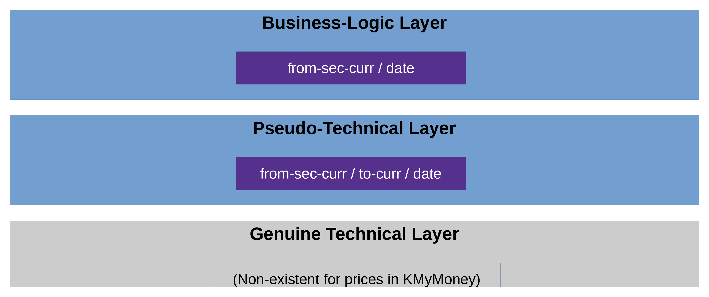

# ID Layers in KMyMoney (Users and Programmers)

## Overview

Generally speaking, you normally have two ID layers in a software, i.e. two 
layers to identify objects:

* the technical layer
* the business-logic layer

A user normally only deals with the business-logic layer, whereas a 
programmer would typically work primarily with the technical layer
and provide services for the business-logic layer only indirectly,
by translating between it and the technical layer.

In 
KMyMoney, 
this system is used for all entities except one: 
the prices.

## Price IDs in KMyMoney

Figure \ref{fig:overview} shows the two levels of price IDs in KMyMoney.

In theory, the two layers mentioned in the previous section
(i.e., the lowest and the highest one in figure \ref{fig:overview})
are clearly separated, i.e. technical IDs and 
business-logic ID do not have anything to do with each other. However, the 
KMyMoney 
developers chose to make things a little more complicated: They intentionally blurred the 
line between the two layers, so that technical IDs are, in fact, pseudo-technical and quasi-business.
More precisely:

* *Pseudo-technical level*: 
  Prices 
  have no technical IDs in 
  KMyMoney. 
  Instead, they are technically selected with a (pseudo-)technical ID, constisting of 
  a from-security (genuine technical ID) or 
  from-currency (pseudo-technical), 
  a to-currency (pseudo-technical), 
  and a date.

* *Business-logic level*: 
  In the real world out there, you normally would identify a 
  price 
  very similarly: 
  by a from-security (public identifier) or from-currency and the date 
  (leaving out the to-currency, which implicitly is set to the default one).

  The public identifier of the from-security, in turn, is the
  public security code, which hopefully you have used when entering the security in the 
  KMyMoney 
  file:
  * If you live in the US or Canada, then you would typically use the 1-to-4-char ticker (such as "T" or "MSFT").
    (The pros among you might use the CUSIP intead.)
  * If you live outside of the US and Canada, then you would typically use something else.
    In the EU, where the current maintainer lives, people typically use the ISIN (international).
    In Germany, the nostalgic folks prefer the WKN.
    Similarly, in the rest of Europe: The SEDOL (UK) or the VALOR (Switzerland), etc. etc.
  
  If you have a global portfolio, it makes sense to use the ISIN.[^1]

So, if the developers had chosen to treat 
prices 
as any other entity in 
KMyMoney, 
then a
price's
technical ID would look something like this: 
`Q000023`.
This string obviously has (almost) no meaning, i.e. it cannot be "interpreted" 
or "understood" nor is it meant to be
(apart from the type defined by the prefix `Q`).[^2]

Well, they chose another approach: In 
KMyMoney, 
a (pseudo-)technical 
price
ID looks something like these:

* `USD:EUR:2022-06-02`     (price of USD in EUR at given date)
* `E000001:EUR:2023-12-01` (price of security in EUR at given date)

(More precisely: the pair `<from-sec-curr>:<to-curr>`, which leads to a list of dates
from which to choose, so together a triple).

Just by glancing at these, you can see that they are essentially business-logic IDs 
maskerading as technical ones; they do mean something (i.e., they have semantics) and 
can thus very well be interpreted and understood.

It is important to understand this (non-)difference between technical and business-logic IDs in
KMyMoney 
before reading the other documents; they might otherwise confuse you.

[^1]: This is how thes current maintainer does it in his own portfolio, and it's been working well
      for decades now.

[^2]: Every entity's ID has a prefix in KMyMoney, except the price, of course. So the 
      `Q` (for quote) does not actually exist, and `P` (for price) is actually used for payees.
